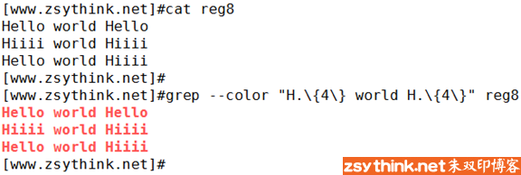
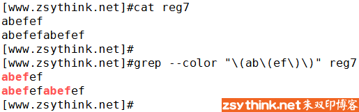

前文中，已经总结了正则表达式中的常用字符、次数匹配、位置匹配等，这篇文章中，我们来了解一下正则中的"分组"与"后向引用"。

 

什么是分组？什么是后向引用？我们慢慢聊。

<!--more-->

先来说说什么是分组。

算了，思考了半天，我也不知道从何说起，先看个示例吧，根据示例去描述反而更加清晰，示例如下。

上述示例中，我们使用到了之前所了解到的"连续次数匹配"，"\{2\}"表示其前面的字符连续出现的2次，即可被匹配到。

但是，正如上图所示，"\{2\}"所影响的字符只是其前面的单个字符，也就是上例中的字母o

所以，上例中，helloo被匹配到了，hellooo也被匹配到了，因为"hell"字符串后面的确出现了2次字母o

 

但是，如果我们想要从上例中的文本中找出，2次连续出现的hello字符串，该怎么办呢？

正如你所看到的，"hello\{2\}"并不能表示"hellohello"，它只能表示"helloo"，那么，我们该怎么办呢？

这个时候，我们就需要用到"分组"，将"hello"当做一个"分组"，当做一个"整体"，才可以达到我们的目的，示例如下

正如上图所示，"\(hello\)"表示将hello字符串当做一个整体，所以，"\{2\}"所影响的字符就是前面的"hello字符串"（这个整体）。

所以，"\(hello\)\{2\}"这个正则表达式就表示hello字符串连续出现两次，也就是"hellohello"

没错，"\(  \)"就表示分组。

"\(  \)"表示将其中的内容看做一个分组，看做一个整体。

 

分组还可以嵌套，什么意思呢？我们来看一个例子。

上图中的正则表达式猛一看有些复杂，但是我们一点一点的拆开来看，就比较容易理解了，没错，我们先按照上图所示，将"红线部分"与"蓝线部分"拆成两部分

蓝线部分为"\{2\}"，表示之前的字符连续出现两次

红线部分为"\(ab\(ef\)\{2\}\)"，可以看到，红线部分的两侧正好由"\(   \)"组成，由此可见，红线部分应该作为一个整体，应该作为一个分组被操作，再结合之前的蓝线部分，即可得知，红线部分应该作为一个整体连续出现两次。

那么，我们把红线部分最外侧的"\(   \)"去掉，红线部分内侧的正则为"ab\(ef\)\{2\}"，可以看到，红线部分内侧的正则中还有一组分组符号，就是"\(ef\)"，这个分组符号把ef当做了一个整体，所以，"ab\(ef\)\{2\}"表示字符串ab后面跟随了2个连续出现的ef，那么，"ab\(ef\)\{2\}"就表示字符串"abefef"。

逆推回去，我们把红线内侧的正则替换为"abefef"，于是，上例中的正则就表示"\(abefef\)\{2\}"，最终如上图所示，2次连续出现的abefef被匹配到了。

上例中，红线部分一共包含两个分组符号，最外侧的"\(   \)"中又包含了另一个"\(   \)"，这就是分组符号的嵌套。

 

我想，我应该说清楚了。

 

那么，我们再来聊聊什么是后向引用。

之所以先介绍分组，是因为后向引用是以分组为前提的，如果想要实现后向引用，则必须先进行分组。

那么"后向引用"是什么意思呢？

如果直接放出概念，我不容易描述，你也不容易理解，我们还是先来看个小例子吧，示例文件如下。

如果我们想要使用正则去匹配上述示例中的两行文本，我们改怎么办呢？

我们可以使用如下正则表达式去匹配。

"H.\{4\}"表示大写字母H的后面跟随了4个任意字符，其中"."表示任意单个字符，我们在前文中已经举例演示过，此处不再赘述。

所以，"H.\{4\}"既可以匹配到Hello，也可以匹配到Hiiii，那么，上述两行文本都被匹配到了。

 

此时，我们修改一下示例文件，在示例文件中再添加一行测试文本，修改后的测试文件内容如下

如上图所示，我们添加了一行文本，这行文本以Hello开头，以Hiiii结尾。

我们使用刚才的正则，能够匹配到这一行新添加的文本吗，我们来试试。

可以看到，新添加的一行文本也被匹配到了，因为"H.\{4\}"表示大写字母H的后面跟随了4个任意字符，最后一行也满足条件，所以也被匹配到了。

 

但是此刻，我有了新需求~~

我只想从上例中找出"world"前后单词相同的那些行，换句话说就是，world之前的单词是Hello，world之后的单词也要是Hello，world之前的单词是Hiiii，world之后的单词也要是Hiiii，只有这种行满足条件。

上例中第三行则不满足条件，因为上例的第三行中，world之前的单词是Hello，而world之后的单词是Hiiii，前后不一致，所以不满足我的条件。

那么我该怎么办呢？之前的正则肯定不行，因为之前的正则也能够将上例中的第三行匹配到。

这个时候，就需要用到"后向引用"，示例如下。

 

可以看到，使用上述正则，即可达到我们的目的，只有world前后的单词完全相同时，才会被匹配到。

那么，上例中的正则是什么意思呢？我们仍然拆成两部分来介绍，以便我们理解。

上例的红线部分为："\(H.\{4\}\)"

上例的蓝线部分为："\1"

 

红线部分的正则与之前示例中的正则只有一点点区别，就是在原来的基础之上添加了分组，将"H.\{4\}"变成了"\(H.\{4\}\)"，但是它的大概含义并没有改变，"\(H.\{4\}\)"表示大写字母H的后面跟随了4个任意字符，并且字母H与后面的4个字符将作为一个整体。那么，为什么要在原来的基础上添加分组呢？这是因为，如果想要实现后向应用，则必须以分组为前提，现在我们暂且不纠结这一点，之后回过头来看，就会明白。

 

蓝色部分的正则为"\1"，它有什么含义呢？

"\1"表示整个正则中第1个分组中的正则所匹配到的结果，这样说可能不容易理解，我们用大白话说一遍。

在上例中，整个正则中只出现了1个分组，就是"\(H.\{4\}\)"，当它与示例文件中的第一行文本进行匹配时，会匹配到Hello字符串，这时，"\1"就表示Hello字符串。

当正则"\(H.\{4\}\)"与示例文件中的第二行文本进行匹配时，会匹配到Hiiii字符串，这时，"\1"就表示Hiiii字符串。

也就是说，"\1"必须与整个正则中第1个分组中的正则（也就是红色部分的正则）所匹配到的结果相同。

换句话说就是，"\1"引用了整个正则中第1个分组中的正则（也就是红色部分的正则）所匹配到的结果。

如果你还没有懂，看图理解吧。

现在回头想想，你知道为什么必须为"H.\{4\}"添加分组了吗？因为，当我们为"H.\{4\}"添加了分组以后，"H.\{4\}"就变成了整个正则中第1个分组中的正则，当"H.\{4\}"匹配到的结果为Hello时，"\1"就引用了Hello，当"H.\{4\}"匹配到的结果为Hiiii时，"\1"就引用了Hiiii。

 

这就是所谓的"后向引用"。

上述描述看一遍可能不容易立马理解，可以重复仔细的多看几遍，慢慢就会理解了。

 

聪明如你，一定想到了。

"\1"表示引用整个正则中第1个分组中的正则所匹配到的结果，那么，"\2"呢？没错，正如你所想。

"\2"表示引用整个正则中第2个分组中的正则所匹配到的结果

示例如下

如上图所示，"\2"引用了上图中"绿线部分的正则"所匹配到的结果，而上图中"绿线部分的正则"就是"整个正则表达式中第2个分组中的正则"。

 

那么，以此类推，"\3"、"\4"、"\5"、"\6"所表达的意思就不言而喻了。

再次强调，使用后向引用的前提是将需要引用的部分分组。

 

不过，当分组嵌套时，我们应该怎样区分哪个分组是第1个分组，哪个分组是第2个分组呢？

我们通过一个小示例，即可明白，为了尽量简化整个正则，我们直接将一些字符分组即可，示例如下。

上述正则表达式中，一共出现了两个分组，一个分组嵌套着另一个分组。

可以从上图中看出，红色标注的符号是一对分组符号，蓝色标注的符号是一对分组符号，红色分组嵌套这蓝色分组。

虽然上例中没有使用到"后向引用"，但是，当我们需要使用"后向引用"时，这两个分组哪个才是第1个分组，哪个是第2个分组呢？

当我们需要使用后向引用时，红色分组为第1个分组，蓝色分组为第2个分组。

换句话说就是，当使用后向引用时，"\1"引用的是红色分组所匹配的结果，"\2"引用的是蓝色分组所匹配的结果。

为什么呢？原因就是，分组的顺序取决于分组符号的左侧部分的顺序，如下图所示

由于红色分组的左侧部分排在最前面，所以红色分组是整个正则中的第1个分组。

由于蓝色分组的左侧部分排在第2位，所以蓝色分组是整个正则中的第2个分组。

注意：排序时也仅仅按照分组符号的左侧部分排序，分组符号的右侧部分不算在排序范围内。

 

好了，"分组"与"后向引用"就总结到这里，我想我应该说明白了，描述起来好费力~~~希望能够帮到你。

之前说过，在Linux中，正则表达式分为基础正则表达式与扩展正则表达式。

而我们之前所描述的符号都属于基本正则表达式。

在以后的文章中，我们会接触到扩展正则表达式，但是不用害怕，它们的用法都是相似的，而且写法也差不多，学会基本正则表达式以后，再学习扩展正则表达式，几乎不会费力。

  